# Instructions

### Group by
1. Contare quanti iscritti ci sono stati ogni anno
    ```SQL
    SELECT YEAR(`enrolment_date`) AS 'enrollment_year', COUNT(id) AS 'enrolled_students'
    FROM `students`
    GROUP BY YEAR(`enrolment_date`);
    ```
    Result:
    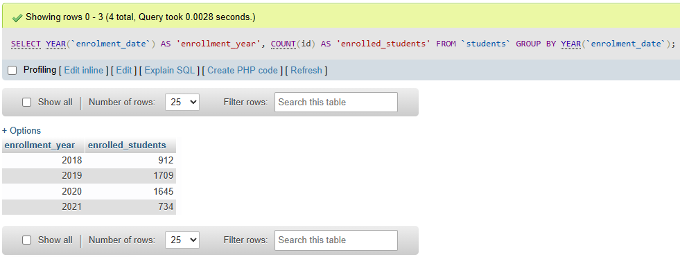

2. Contare gli insegnanti che hanno l'ufficio nello stesso edificio
    ```SQL
    SELECT `office_address`, COUNT(id) AS 'teachers_in_this_building'
    FROM `teachers`
    GROUP BY `office_address`;
    ```
    Result:
    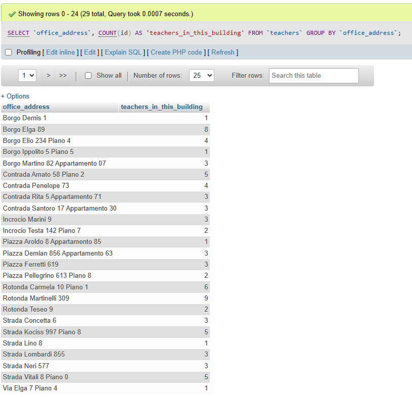

3. Calcolare la media dei voti di ogni appello d'esame
    ```SQL
    SELECT `courses`.`name` AS 'course_name', ROUND(AVG(`exam_student`.`vote`), 1) AS 'exam_vote_avg'
    FROM `exams`
    JOIN `exam_student` ON `exam_student`.`exam_id` = `exams`.`id`
    JOIN `courses` ON `courses`.`id` = `exams`.`course_id`
    GROUP BY `courses`.`name`
    ORDER BY `exam_vote_avg` DESC;
    ```
    Result:
    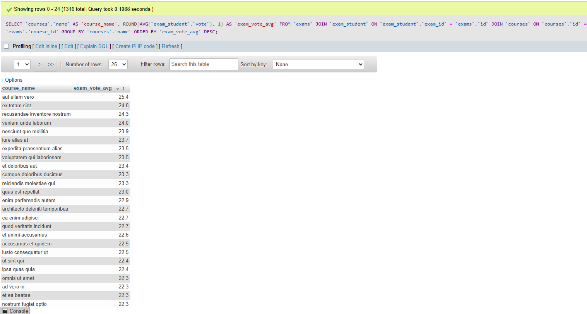

4. Contare quanti corsi di laurea ci sono per ogni dipartimento
    ```SQL
    SELECT `departments`.`name` AS 'department_name', COUNT(`degrees`.`id`) AS 'number_of_degrees'
    FROM `degrees` JOIN `departments` ON `departments`.`id` = `degrees`.`department_id`
    GROUP BY `departments`.`name`
    ORDER BY `number_of_degrees` DESC;
    ```
    Result:
    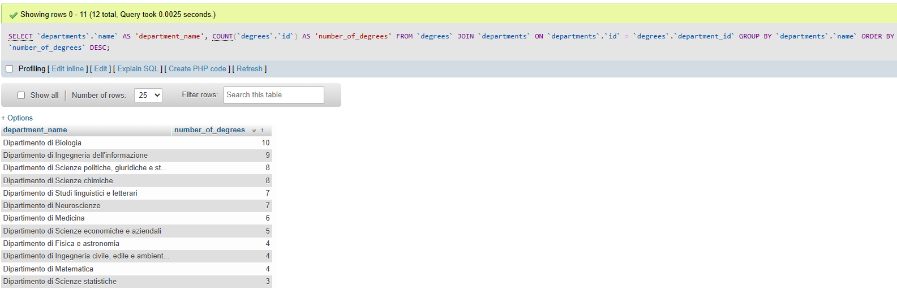

### Joins
1. Selezionare tutti gli studenti iscritti al Corso di Laurea in Economia
    ```SQL
    SELECT `students`.`name` AS 'student_name', `students`.`surname` AS 'student_surname', `students`.`registration_number`, `degrees`.`name` AS 'degree_name'
    FROM `students` JOIN `degrees` ON `degrees`.`id` = `students`.`degree_id`
    WHERE `degrees`.`name` = 'Corso di Laurea in Economia';
    ```
    Result:
    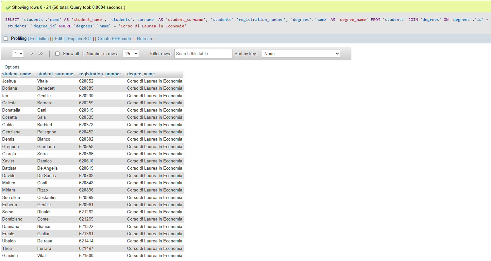

2. Selezionare tutti i Corsi di Laurea Magistrale del Dipartimento di Neuroscienze
    ```SQL
    SELECT `degrees`.`name` , `degrees`.`level`, `departments`.`name`
    FROM `degrees`
    JOIN `departments` ON `departments`.`id` = `degrees`.`department_id`
    WHERE `degrees`.`level` = 'magistrale' AND `departments`.`name` = 'Dipartimento di Neuroscienze';
    ```
    Result:
    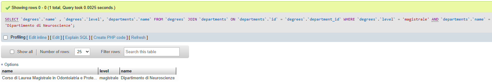

3. Selezionare tutti i corsi in cui insegna Fulvio Amato (id=44)
    ```SQL
    SELECT `teachers`.`name` AS 'teacher_name', `teachers`.`surname` AS 'teacher_surname', `courses`.`name` AS 'course_name', `courses`.`description` AS 'course_description'
    FROM `teachers`
    JOIN `course_teacher` ON `teachers`.`id` = `course_teacher`.`teacher_id`
    JOIN `courses` ON `courses`.`id` = `course_teacher`.`course_id`
    WHERE `teachers`.`id` = 44;
    ```
    Result:
    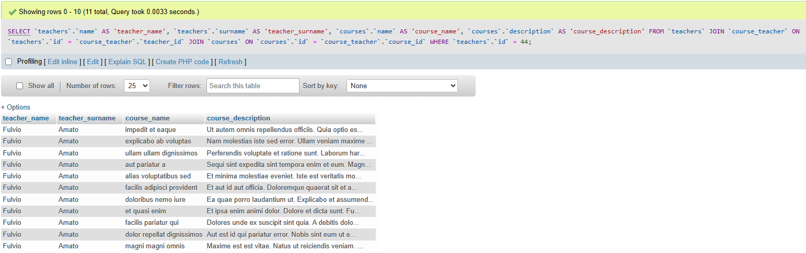

    Il filtro della query poteva anche essere scritto ```WHERE `teachers`.`name` = 'Fulvio' AND `teachers`.`surname` = 'Amato';```

4. Selezionare tutti gli studenti con i dati relativi al corso di laurea a cui sono iscritti e il relativo dipartimento, in ordine alfabetico per cognome e nome
    ```SQL
    SELECT `students`.`surname` AS 'student_surname',
    `students`.`name` AS 'student_name',
    `degrees`.`name` AS 'degree_name',
    `degrees`.`level` AS 'degree_level',
    `degrees`.`address` AS 'degree_address',
    `degrees`.`email` AS 'degree_email',
    `degrees`.`website` AS 'degree_website',
    `departments`.`name` AS 'department_name'
    FROM `students`
    JOIN `degrees` ON `degrees`.`id` = `students`.`degree_id`
    JOIN `departments` ON `departments`.`id` = `degrees`.`department_id`
    ORDER BY `students`.`surname` ASC;
    ```
    Result:
    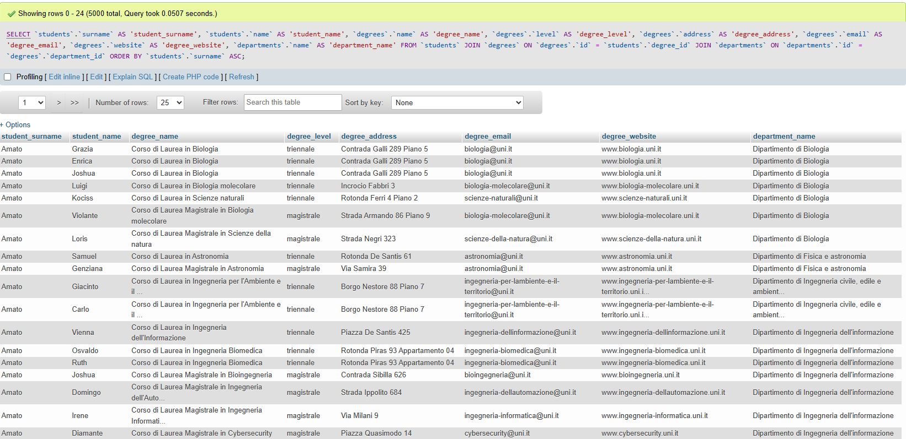

5. Selezionare tutti i corsi di laurea con i relativi corsi e insegnanti
    ```SQL
    SELECT `degrees`.`name` AS 'degree_name',
    `courses`.`name` AS 'course_name',
    `courses`.`description` AS 'course_description',
    `teachers`.`name` AS 'teacher_name',
    `teachers`.`surname` AS 'teacher_surname'
    FROM `courses` JOIN `course_teacher` ON `courses`.`id` = `course_teacher`.`course_id`
    JOIN `teachers` ON `teachers`.`id` = `course_teacher`.`teacher_id`
    JOIN `degrees` ON `degrees`.`id` = `courses`.`degree_id`
    ORDER BY `degrees`.`name` ASC;
    ```
    Result:
    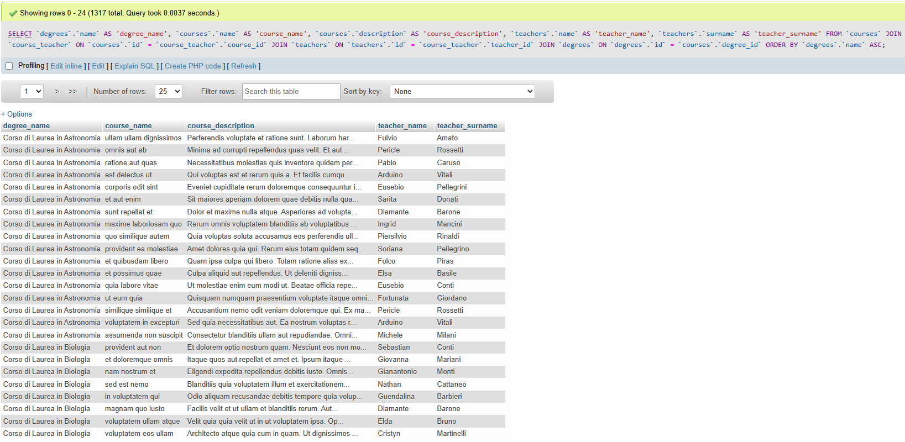

6. Selezionare tutti i docenti che insegnano nel Dipartimento di Matematica (54)
    ```SQL
    SELECT `teachers`.`surname` AS 'teacher_surname', 
    `teachers`.`name` AS 'teacher_name',
    `departments`.`name` AS 'department_name'
    FROM `teachers`
    JOIN `course_teacher` ON `teachers`.`id` = `course_teacher`.`teacher_id`
    JOIN `courses`  ON `courses`.`id` = `course_teacher`.`course_id`
    JOIN `degrees` ON `degrees`.`id` = `courses`.`degree_id`
    JOIN `departments` ON `departments`.`id` = `degrees`.`department_id`
    WHERE `departments`.`name` = 'Dipartimento di Matematica'
    ORDER BY `teachers`.`surname` ASC;
    ```
    Result:
    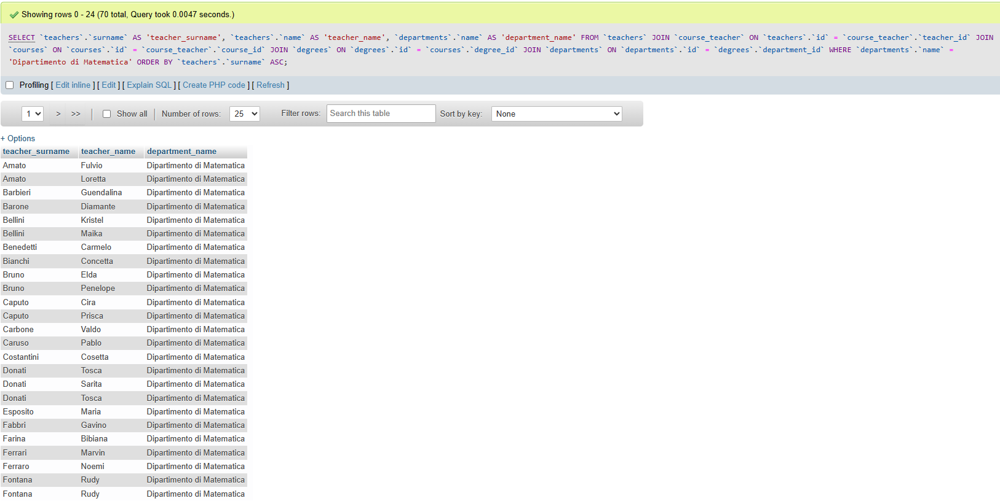

    Il filtro della query poteva anche essere scritto ```WHERE `departments`.`id` = 5;```

#### BONUS
1. Selezionare per ogni studente il numero di tentativi sostenuti per ogni esame, stampando anche il voto massimo. 

    ```SQL
    SELECT `students`.`surname` AS 'student_surname', `students`.`name` AS 'student_name', `courses`.`name` AS 'course_name', COUNT(`courses`.`id`) AS 'number_of_try', MAX(`exam_student`.`vote`) AS 'max_vote'
    FROM `students`
    JOIN `exam_student` ON `students`.`id` = `exam_student`.`student_id`
    JOIN `exams` ON `exams`.`id` = `exam_student`.`exam_id`
    JOIN `courses` ON `courses`.`id` = `exams`.`course_id`
    JOIN `degrees` ON `degrees`.`id` = `courses`.`degree_id`
    GROUP BY `students`.`surname`, `students`.`name`, `courses`.`name`
    ORDER BY `students`.`surname` ASC;
    ```
    Result:
    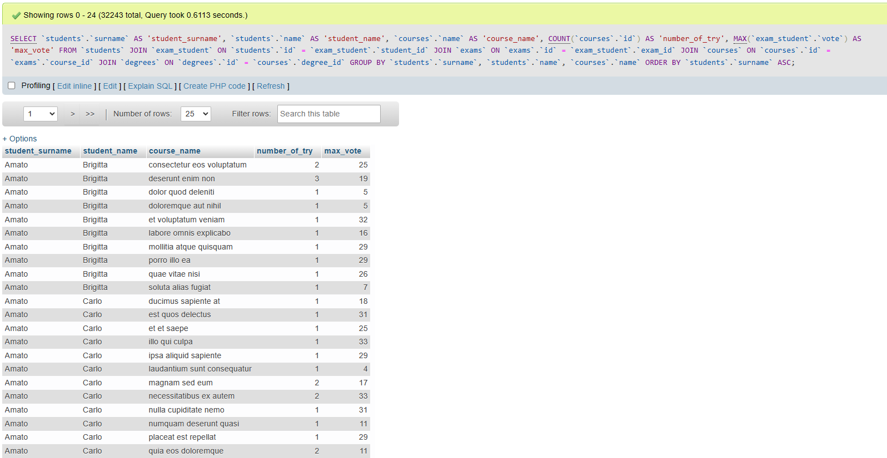

2. Successivamente, filtrare i tentativi con voto minimo 18.

    Per filtrare i risultati si può aggiungere ```WHERE `exam_student`.`vote` >= 18``` subito prima dell'istruzione ```GRUOP BY```. Tuttavia la tabella risultante non avrebbe molto senso: in quanto si sta filtrando solo gli esami superati, il numero di tentativi sarà sempre 1.
    Si potrebbe strutturare una nuova tabella utilizzando la query seguente:

    ```SQL
    SELECT `students`.`surname` AS 'student_surname', `students`.`name` AS 'student_name', `courses`.`name` AS 'passed_course_name',`exam_student`.`vote` AS 'exam_vote'
    FROM `students`
    JOIN `exam_student` ON `students`.`id` = `exam_student`.`student_id`
    JOIN `exams` ON `exams`.`id` = `exam_student`.`exam_id`
    JOIN `courses` ON `courses`.`id` = `exams`.`course_id`
    JOIN `degrees` ON `degrees`.`id` = `courses`.`degree_id`
    WHERE `exam_student`.`vote` >= 18
    GROUP BY `students`.`surname`, `students`.`name`, `courses`.`name`, `exam_student`.`vote`
    ORDER BY `students`.`surname` ASC;
    ```

    Result: 
    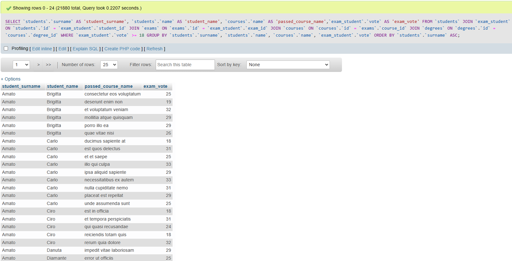

    In questo modo si elimina la colonna ```number_of_try``` e si cambia la colonna ```max_vote``` in ```exam_vote``` che ora mostra sempre un voto superiore a 18 (e non il massimo voto ottenuto in quell'esame). Si ottiene così una tabella che mostra lo studente,tutti gli esami che ha superato e il voto con cui li ha superati.


